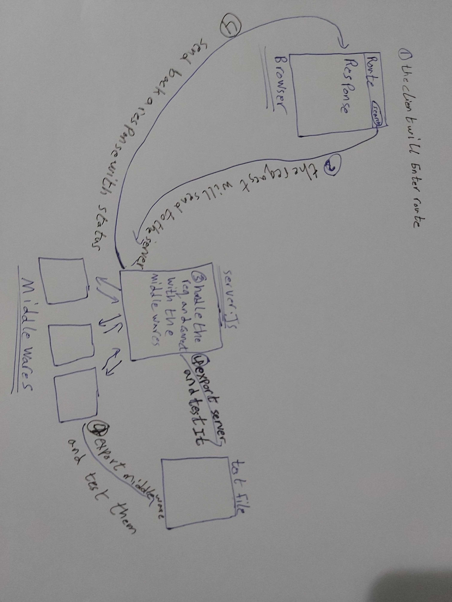

# LAB - 07

<!-- ## Project: Project Name Here -->
## Express

### Author: Abdallah Obaid

### Links and Resources

* [submission PR](https://github.com/Abdallah-401-advanced-javascript/api-server/pull/3)
* [travis](https://github.com/Abdallah-401-advanced-javascript/api-server/pull/3/checks?check_run_id=728865550)
* [ci/cd](https://github.com/Abdallah-401-advanced-javascript/api-server/pull/3/checks?check_run_id=728867092)
<!-- - [back-end server url](http://xyz.com) (when applicable) -->
<!-- * [front-end application](https://abdallah-lab-00.herokuapp.com/)  -->

### Documentation
<!-- * [jsdoc](https://abdallah-lab-00.herokuapp.com/docs/) -->
* [swagger](https://app.swaggerhub.com/apis/AbdallahObaid/class-06/0.1) 

### Modules
#### `timestamp.js` , `logger.js` , `500.js`, `404.js`
##### Exported Values and Methods

###### `node index.js `
This will start listening.
###### `timestamp.js`
This will give us the date for the request.
###### `logger.js`
This will console our method, date and path.
###### `404.js`
This will console for not exist route.
###### `500.js`
This will console the server errors.

### Setup

#### `.env` requirements 
const PORT = port || process.env.PORT || 3000;

#### How to initialize/run your application 

* `npm init -y`
*  use git,postman or sawgger to use crud methods.

#### How to use your library (where applicable)
<!-- * use const lib=require('lib') -->
const logRequest = require('../middleware/logger.js');
const timestamp = require('../middleware/timestamp.js');
const err500 = require('../middleware/500.js');
const err404 = require('../middleware/404.js');

#### Tests

* Unit Tests: `npm test`
* Lint Tests: `npm run lint`

<!-- Incomplete Tests: -->

#### UML

